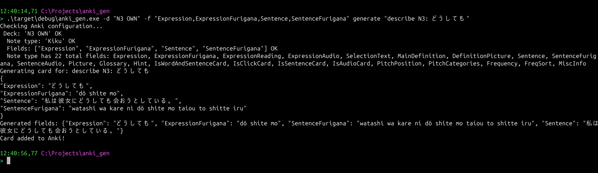

# anki_gen

Generate Anki flashcards using LLMs.

> 🛋️ Under lazy development. Any help would be good!



## Usage

```bash
# Check connectivity
anki_gen check

# Generate a single card
anki_gen generate "ておく grammar point" -d "Japanese" -f "Grammar,Meaning,Example"

# Generate next in sequence (skips duplicates)
anki_gen next "JLPT N3 grammar" -d "Japanese" -f "Grammar,Meaning,Example"

# Batch from list or file
anki_gen batch "item1,item2,item3" -d "Deck" -f "Front,Back"
anki_gen batch "@items.txt" -d "Deck" -f "Front,Back"
```

## Configuration

Configuration is loaded with the following priority (highest to lowest):
1. **CLI arguments** (e.g., `--model`, `--deck`)
2. **Config file** (`config.yaml` or `config.json`)
3. **Default values** (defined in code)

### Config File

Create a `config.yaml` or `config.json` in the project root:

```yaml
# config.yaml
model: llama3
ollama_url: http://localhost:11434
anki_url: http://localhost:8765
deck: Japanese
note_type: Kiku
fields:
  - Grammar
  - Meaning
  - Example
storage_path: storage/used_grammar.json
```

Or JSON:
```json
{
  "model": "llama3",
  "ollama_url": "http://localhost:11434",
  "anki_url": "http://localhost:8765",
  "deck": "Japanese",
  "note_type": "Kiku",
  "fields": ["Grammar", "Meaning", "Example"],
  "storage_path": "storage/used_grammar.json"
}
```

See `config.example.yaml` or `config.example.json` for templates.

### CLI Overrides

Any CLI argument will override the config file:

```bash
# Uses config file defaults, but overrides deck
anki_gen generate "..." -d "CustomDeck"

# Uses different model
anki_gen generate "..." --model gemma2
```

Default note type is "Kiku" (check out [youyoumu/kiku](https://github.com/youyoumu/kiku) - very cool note). Specify your own with `-n`:

```bash
anki_gen generate "..." -d "Deck" -f "Front,Back" -n "Basic"
```

Tested with llama3 (usually bugs). YMMV with other models.

## Requirements

- Running Anki with [AnkiConnect](https://ankiweb.net/shared/info/2055492159)
- LLM API (default: Ollama on localhost:11434)
